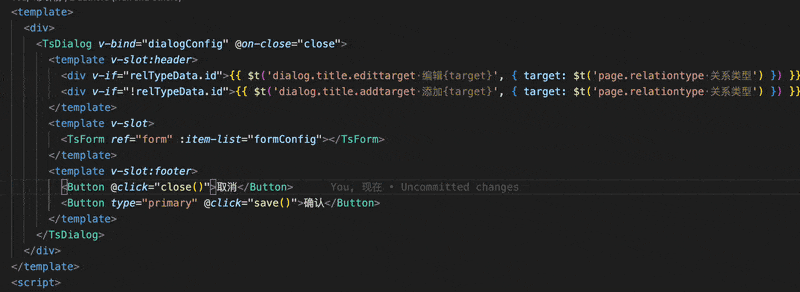

[中文](README.md) / English

<p>
    <a href="https://opensource.org/license/gpl-3-0/" alt="License">
        </a>
<a target="_blank" href="https://join.slack.com/t/neatlogichome/shared_invite/zt-1w037axf8-r_i2y4pPQ1Z8FxOkAbb64w">
</a>
<a target="_blank" href="https://marketplace.visualstudio.com/items?itemName=neatlogic.i18nhelper"></a>
</p>

---

## Feature

Automatically convert the selected text to the key in i18n. If the key does not exist, it will automatically write the key and text content to the corresponding i18n configuration file.


## Requirements

This plugin requires i18n files to be organized by type, for example, there are two i18n configuration files page/zh.json and button/zh.json respectively, which manage page translation and button translation respectively. The internal organizational structure is:

page/zh.json:

```json
{
  "name": "name",
  "age": "age"
}
```

`button/zh.json`

```json
{
  "submit": "submit",
  "delete": "delete"
}
```

Usage in code:

```js
$t("page.name");
$t("button.submit");
```

If your i18n organizational structure is similar to the above, you can use this plugin to conveniently manage all keys and copywriting.

## How to use

1. Open the editor context menu and click `i18nhelper: configure` to create or edit the config file.

```json
{
  "i18nhelper": [
    {
      "type": "page",
      "path": "/src/resources/assets/languages/page/zh.json",
      "path_en": "/src/resources/assets/languages/page/en.json", //target language config file
      "path_jp": "/src/resources/assets/languages/page/jp.json" //target language config file
    },
    {
      "type": "button",
      "path": "/src/resources/assets/languages/button/zh.json",
      "path_en": "/src/resources/assets/languages/button/en.json", //target language config file
      "path_jp": "/src/resources/assets/languages/button/jp.json" //target language config file
    }
  ],
  "format": "$t(#('?')#(,?))",
  "forecast": 8,
  "translate": {
    "source": "zh",
    "target": ["en", "jp"], //target language list
    "appid": "Baidu appid",
    "secret": "Baidu key"
  }
}
```

Notes:

- `path` is a relative path from the workspace root
- the top-level `type` is the category prefix used in i18n keys

If one category needs to write different keys into different module files, you can configure `children` under that category:

```json
{
  "type": "button",
  "path": "/src/resources/assets/languages/button/zh.json",
  "path_en": "/src/resources/assets/languages/button/en.json",
  "children": [
    {
      "type": "button.operation.",
      "path": "/src/commercial-module/module/languages/button/zh.json",
      "path_en": "/src/commercial-module/module/languages/button/en.json"
    }
  ]
}
```

Notes:

- `children` defines additional write rules
- child `type` is used to match the full i18n key
- when a key starts with that value, the extension writes into the corresponding child `path` and `path_en`

2. Select some text, open the context menu, and click `i18nhelper: replace`.  
   The extension replaces the selected text with the matching i18n key.  
   If the key does not exist, you can enter a new key and the extension will write it into the corresponding i18n files.

3. If `translate` is configured, the extension can automatically write translated text by using the Baidu Translate API.

4. You can bind a shortcut key to `i18nhelper.replace`.
